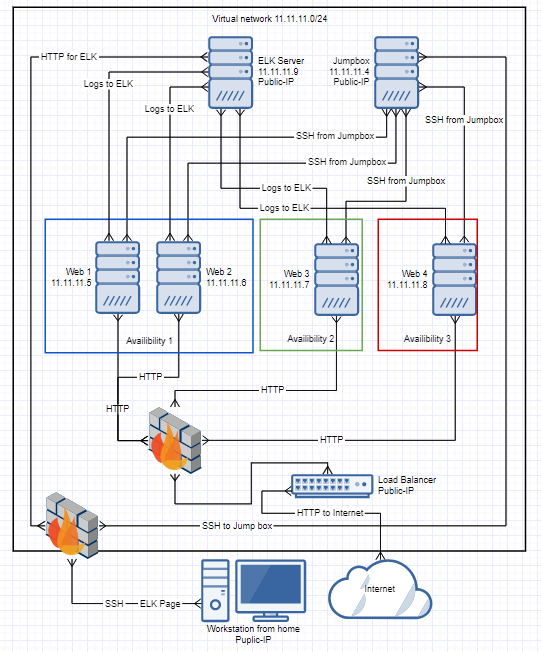
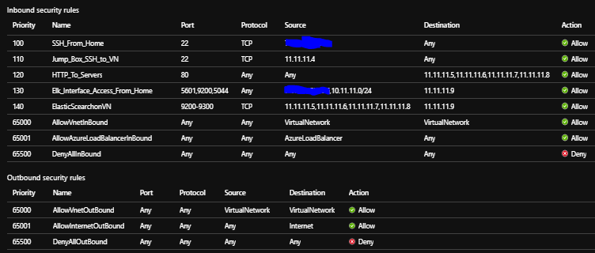
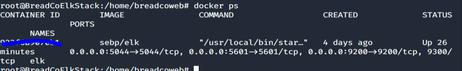

# BreadCo_Elk_Stack

********************************************************************************

The files in this repository were used to configure the network deployment 
depicted below.

All machines were spun up using Azure's provided Linux (ubuntu 18.04) operating 
system.

| Machine                  | Function  | VN IP Address | Container           |
|--------------------------|-----------|---------------|---------------------|
| JumpToBreadCoWebServices | Gateway   | 11.11.11.4    | ansible             |
| BreadCoWebServer1        | Webserver | 11.11.11.5    | cyberxsecurity/dvwa |
| BreadCoWebServer2        | Webserver | 11.11.11.6    | cyberxsecurity/dvwa |
| BreadCoWebServer3        | Webserver | 11.11.11.7    | cyberxsecurity/dvwa |
| BreadCoWebServer4        | Webserver | 11.11.11.8    | cyberxsecurity/dvwa |
| BreadCoElkStack          | ELKServer | 11.11.11.9    | sebp/elk            |

These files have been tested and used to generate a live ELK deployment on Azure. 
They can be used to recreate the entire deployment pictured above. 

This document contains the following details:
- Description of the Topology
- Access Policies
- ELK Configuration
  - Beats in Use## Automated ELK Stack Deployment for BreadCo.
  - Machines Being Monitored
- List of files used
- Links to usage guides to help get a similar set-up going.

### Description of the Topology

The main purpose of this network is to expose a load-balanced and monitored 
instance of DVWA, the D*mn Vulnerable Web Application.

Load balancing ensures that the application will be highly redundant.

Integrating an ELK server allows users to easily monitor the vulnerable VMs for 
changes to the systems. Filebeat exports logs from the webservers to the ELK server 
so that they can be presented and parsed by Kibanna through an accessed webpage.

### Access Policies

The machines on the internal network are not exposed to the public Internet. 

Only the JumpToBreadCoWebServices machine can accept connections from the Internet.
Access to this machine is only allowed from designated IP addresses.

Machines within the network can only be accessed by JumpToBreadCoWebServices.

The webpage access to the ELK machine is only allowed by designated IP addresses.
A summary of the access policies in place can be found in the table below.

| Machine                  | Public Access | Allowed IP addresses |
|--------------------------|---------------|----------------------|
| JumpToBreadCoWebServices | Yes           | 11.11.11.5-9         |
| BreadCoWebServer1        | No            | None                 |
| BreadCoWebServer2        | No            | None                 |
| BreadCoWebServer3        | No            | None                 |
| BreadCoWebServer4        | No            | None                 |
| BreadCoElkStack          | ELK page only | None                 |

There is always a few steps to take when securing a newly created linux system.

### WebServer Configuration

Ansible was used to automate configuration of the webservers.
No configuration is performed manually to allow for easy expandability.

The deploywebservers.yml playbook implements the following tasks:
- Installs docker to the webservers.
- Installs the dependancy "pip" to the webservers.
- Downloads installs and starts the dwva webserver container.

The deployfilebeattowebservers.yml playbook implements the following tasks:
- Downloads filebeat-7.4.0-amd64.deb to the webservers.
- Installs filebeat to the webservers.
- Drops in the filebeat.yml config file.
- Enables the filebeat modules system.
- Runs the filebeat setup command.
- Starts the filebeat services.

The deploymetricbeattowebserver.yml playbook implements the following tasks:
- Downloads metricbeat-7.4.0-amd64.deb to the webservers.
- Installs metricbeat to the webservers.
- Drops in the metric.yml config file.
- Enables the metricbeat docker modules system.
- Runs the metricbeat setup command.
- Starts the metricbeat services.

### Elk Configuration

Ansible was used to automate configuration of the ELK machine as well. 
Again, no configuration is performed manually to allow for easy expandability.
Though there is only 1 elk server in this configuration, as the playbook could
install and start multiple elk servers at once the plural is used.

The deployelkservers.yml playbook implements the following tasks:
- Installs docker to the elkservers.
- Installs the dependancy "pip" to the elkservers.
- Increases virtual memory to that which elk requires.
- Downloads and launches the elk docker container with the needed ports.

The following screenshot displays the result of running `docker ps` after 
successfully configuring the ELK instance.

### Target Machines & Beats
This ELK server is configured to monitor the webserver machines.

We have installed the following Beats on these machines:

-Filebeats:

-Metricbeats:

### Using the Playbooks

-Setting up the Azure network machines is not included in any guides here.

-See "https://github.com/Bradley-Stradling/BreadCo_Elk_Stack/blob/master/Usage_Guides/Configuring_Ansible.md" to see the set up for ansible container on the jump box system. The ansible container setup is required for setting up or deploying
any of the playbooks.

-See "https://github.com/Bradley-Stradling/BreadCo_Elk_Stack/blob/master/Usage_Guides/Configuring_DVWA_Webservers.md" to see the set-up and deployment of the dvwa webservers.

-See "https://github.com/Bradley-Stradling/BreadCo_Elk_Stack/blob/master/Usage_Guides/Configuring_ELK.md" to see the set-up and deployment of of the elk server.

-See "https://github.com/Bradley-Stradling/BreadCo_Elk_Stack/blob/master/Usage_Guides/Configuring_File_Beats.md" to see the set-up and deployment of filebeats.

-See "https://github.com/Bradley-Stradling/BreadCo_Elk_Stack/blob/master/Usage_Guides/Configuring_Metric_Beats.md" to see the set-up and deployment of metricbeats.

## File List

Common locations are either defaults or where I arbitrarily decided to keep them.

### ansible.cfg
- Common location: /etc/ansible/ansible.cfg
- Description: configuration file for the ansible docker
- Changes I made: added remote username on line 111. This allows for ansible to reach boxes on SSH

### deployelkservers.yml
- Common location: /etc/ansible/deployelkservers.yml
- Description: playbook for deploying and starting the elk docker

### deployfilebeattowebservers.yml
- Common location: /etc/ansible/ansible.cfg
- Description: playbook for deploying and starting the dvwa dockers

### deploymetricbeattowebserver.yml
- Common location: /etc/ansible/deploymetricbeattowebserver.yml
- Description: playbook for deploying and starting metricbeat on the webservers

### deploywebservers.yml
- Common location: /etc/ansible/deploywebservers.yml
- Description: playbook for deploying and starting the dvwa dockers

### filebeat.yml
- Common location: /etc/ansible/filebeat.yml
- Description: playbook for deploying and starting the filebeat on the webservers
- Changes I made: line 1107 and 1807 host to ip for elk server

### hosts
- Common location: /etc/ansible/hosts
- Description: configuration file for the ansible playbook hosts
- Changes I made: added ip for webservers and ip for elk server

### metricbeat.yml
- Common location: /etc/metricbeat/metricbeat.yml
- Description: 
- Changes I made: line 69 and 96 host to ip for elk server
